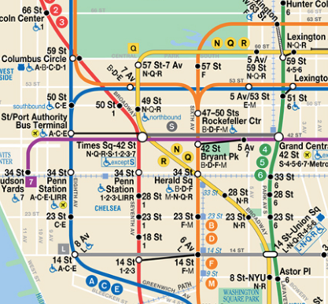
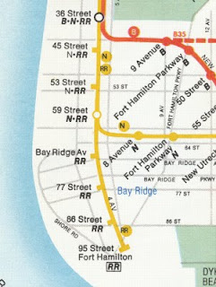

# skiplist

<p float="center">
  
</p>

<p float="center">
  
</p>

<p float="center">
    
    
</p>

[Express Or Local](http://warofyesterday.blogspot.com/2010/03/subway-map-ii.html)

### Example #1

```haskell
$ ./skiplist 
Add 4
Adding 4 to 1 levels from floor
Skip List:
L00 -> 04 -> nil 

Add 7
Adding 7 to 2 levels from floor
Skip List:
L01 -------> 07 -> nil 
L00 -> 04 -> 07 -> nil 

Add 15
Adding 15 to 1 levels from floor
Skip List:
L01 -------> 07 -> nil 
L00 -> 04 -> 07 -> 15 -> nil 

Add 20
Adding 20 to 2 levels from floor
Skip List:
L01 -------> 07 -------> 20 -> nil 
L00 -> 04 -> 07 -> 15 -> 20 -> nil 

Add 12
Adding 12 to 5 levels from floor
Skip List:
L04 -------------> 12 -> nil 
L03 -------------> 12 -> nil 
L02 -------------> 12 -> nil 
L01 -------> 07 -> 12 -------> 20 -> nil 
L00 -> 04 -> 07 -> 12 -> 15 -> 20 -> nil 

Find 15, found?  true  value:  &{15 [0xc00009e080]}  level:  0
Find 10, found?  false  value:  <nil>
Find 12, found?  true  value:  &{12 [0xc00009e060 0xc00009e080 <nil> <nil> <nil>]}

Delete 12

Skip List:
L01 -------> 07 -------> 20 -> nil 
L00 -> 04 -> 07 -> 15 -> 20 -> nil 

Find 12 (again), found?  false  value:  <nil>
```

### Example #2
```haskell
$ ./skiplist 
Add 4
Adding 4 to 1 levels from floor
Skip List:
L00 -> 04 -> nil 

Add 7
Adding 7 to 1 levels from floor
Skip List:
L00 -> 04 -> 07 -> nil 

Add 15
Adding 15 to 2 levels from floor
Skip List:
L01 -------------> 15 -> nil 
L00 -> 04 -> 07 -> 15 -> nil 

Add 20
Adding 20 to 4 levels from floor
Skip List:
L03 -------------------> 20 -> nil 
L02 -------------------> 20 -> nil 
L01 -------------> 15 -> 20 -> nil 
L00 -> 04 -> 07 -> 15 -> 20 -> nil 

Add 12
Adding 12 to 3 levels from floor
Skip List:
L03 -------------------------> 20 -> nil 
L02 -------------> 12 -------> 20 -> nil 
L01 -------------> 12 -> 15 -> 20 -> nil 
L00 -> 04 -> 07 -> 12 -> 15 -> 20 -> nil 

Find 15, found?  true  value:  &{15 [0xc00009e0a0 0xc00009e0a0]}
Find 10, found?  false  value:  <nil>
Find 12, found?  true  value:  &{12 [0xc00009e060 0xc00009e060 0xc00009e0a0]}

Delete 12

Skip List:
L03 -------------------> 20 -> nil 
L02 -------------------> 20 -> nil 
L01 -------------> 15 -> 20 -> nil 
L00 -> 04 -> 07 -> 15 -> 20 -> nil 

Find 12 (again), found?  false  value:  <nil>

Add 6
Adding 6 to 5 levels from floor
Skip List:
L04 -------> 06 -> nil 
L03 -------> 06 -------------> 20 -> nil 
L02 -------> 06 -------------> 20 -> nil 
L01 -------> 06 -------> 15 -> 20 -> nil 
L00 -> 04 -> 06 -> 07 -> 15 -> 20 -> nil 

Values: 4 6 7 15 20 
All w/ Levels: 
(4, 6) 
(3, 6) (3, 20) 
(2, 6) (2, 20) 
(1, 6) (1, 15) (1, 20) 
(0, 4) (0, 6) (0, 7) (0, 15) (0, 20)
```

### Example #3
```haskell

$ ./skiplist 
Add 4
Adding 4 to 5 levels from floor
Skip List:
L04 -> 04 -> nil 
L03 -> 04 -> nil 
L02 -> 04 -> nil 
L01 -> 04 -> nil 
L00 -> 04 -> nil 

Add 7
Adding 7 to 5 levels from floor
Skip List:
L04 -> 04 -> 07 -> nil 
L03 -> 04 -> 07 -> nil 
L02 -> 04 -> 07 -> nil 
L01 -> 04 -> 07 -> nil 
L00 -> 04 -> 07 -> nil 

Add 15
Adding 15 to 2 levels from floor
Skip List:
L04 -> 04 -> 07 -> nil 
L03 -> 04 -> 07 -> nil 
L02 -> 04 -> 07 -> nil 
L01 -> 04 -> 07 -> 15 -> nil 
L00 -> 04 -> 07 -> 15 -> nil 

Add 20
Adding 20 to 1 levels from floor
Skip List:
L04 -> 04 -> 07 -> nil 
L03 -> 04 -> 07 -> nil 
L02 -> 04 -> 07 -> nil 
L01 -> 04 -> 07 -> 15 -> nil 
L00 -> 04 -> 07 -> 15 -> 20 -> nil 

Add 12
Adding 12 to 2 levels from floor
Skip List:
L04 -> 04 -> 07 -> nil 
L03 -> 04 -> 07 -> nil 
L02 -> 04 -> 07 -> nil 
L01 -> 04 -> 07 -> 12 -> 15 -> nil 
L00 -> 04 -> 07 -> 12 -> 15 -> 20 -> nil 

Find 15, found?  true  value:  &{15 [0xc00009e0e0 <nil>]}
Find 10, found?  false  value:  <nil>
Find 12, found?  true  value:  &{12 [0xc00009e0a0 0xc00009e0a0]}

Delete 12

Skip List:
L04 -> 04 -> 07 -> nil 
L03 -> 04 -> 07 -> nil 
L02 -> 04 -> 07 -> nil 
L01 -> 04 -> 07 -> 15 -> nil 
L00 -> 04 -> 07 -> 15 -> 20 -> nil 

Find 12 (again), found?  false  value:  <nil>

Add 6
Adding 6 to 2 levels from floor
Skip List:
L04 -> 04 -------> 07 -> nil 
L03 -> 04 -------> 07 -> nil 
L02 -> 04 -------> 07 -> nil 
L01 -> 04 -> 06 -> 07 -> 15 -> nil 
L00 -> 04 -> 06 -> 07 -> 15 -> 20 -> nil 

Values: 4 6 7 15 20 
All w/ Levels: 
(4, 4) (4, 7) 
(3, 4) (3, 7) 
(2, 4) (2, 7) 
(1, 4) (1, 6) (1, 7) (1, 15) 
(0, 4) (0, 6) (0, 7) (0, 15) (0, 20) 

All Unique by Levels: (4, 4) (4, 7) (1, 6) (1, 15) (0, 20) 

Path Traversal for target 15: (4, 4) (4, 7) (1, 15) 
Path Traversal length is 3
```

### Example #4 - strings

```haskell

$ ./skiplist 
Add ba
Adding ba to 1 levels from floor
Skip List:
L00 -> ba -> nil 

Add ze
Adding ze to 1 levels from floor
Skip List:
L00 -> ba -> ze -> nil 

Add ca
Adding ca to 1 levels from floor
Skip List:
L00 -> ba -> ca -> ze -> nil 

Add co
Adding co to 4 levels from floor
Skip List:
L03 -------------> co -> nil 
L02 -------------> co -> nil 
L01 -------------> co -> nil 
L00 -> ba -> ca -> co -> ze -> nil 

Add ew
Adding ew to 2 levels from floor
Skip List:
L03 -------------> co -> nil 
L02 -------------> co -> nil 
L01 -------------> co -> ew -> nil 
L00 -> ba -> ca -> co -> ew -> ze -> nil 

Find 1, found?  true  value:  &{co [0xc0000942a0 0xc0000942a0 <nil> <nil>]}
Find 2, found?  true  value:  &{ca [0xc000094270]}
Find 3, found?  true  value:  &{ca [0xc000094270]}

Delete co

Skip List:
L01 -------------> ew -> nil 
L00 -> ba -> ca -> ew -> ze -> nil 

Find co (again), found?  false  value:  <nil>

Add bl
Adding bl to 3 levels from floor
Skip List:
L02 -------> bl -> nil 
L01 -------> bl -------> ew -> nil 
L00 -> ba -> bl -> ca -> ew -> ze -> nil 

Values: ba bl ca ew ze 
All w/ Levels: 
(2, bl) 
(1, bl) (1, ew) 
(0, ba) (0, bl) (0, ca) (0, ew) (0, ze) 

All Unique by Levels: (2, bl) (1, ew) (0, ba) (0, ca) (0, ze) 

Path Traversal for target ze: (2, bl) (1, ew) (0, ze) 
Path Traversal length is 3
``` 
